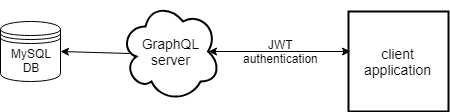

# Server Koan C# #

## Introduction ##

The purpose of the code published to this repository is to learn C#. The implemented application is specified by the [server-koan-spec](https://github.com/softozor/server-koan-spec). It is essentially a server application that manages lists of todo lists. The philosophy chosen in this codebase is to implement a GraphQL server which will communicate with a MySQL database. The server provides JWT authentication. 

## Documentation ##

* [Project setup in Visual Studio 2017](doc/ProjectSetup.md)
* [Learnings on SpecFlow](doc/SpecFlowLearnings.md)
* [Learnings on GraphQL tests](doc/GraphqlTestsLearnings.md)