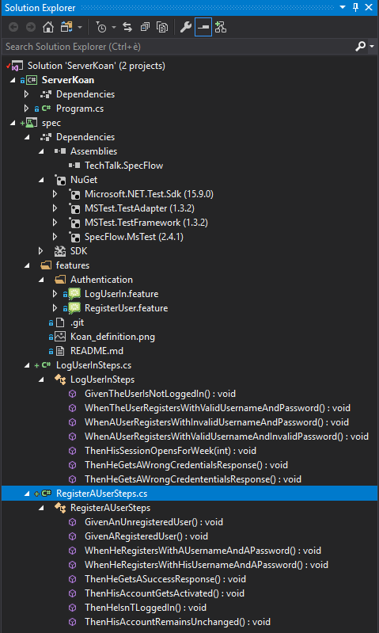

# The steps I followed to setup the project

## Visual Studio setup

* install [SemanticColorizer](https://marketplace.visualstudio.com/items?itemName=AndreasReischuck.SemanticColorizer) to highlight code (class members, variables, namespaces, etc.) appropriately
* install [Microsoft Code Analysis](https://docs.microsoft.com/en-us/visualstudio/code-quality/install-fxcop-analyzers?view=vs-2017) to perform static code analysis

## Project setup

The integration of the Gherkin features as well as the initial generation of the corresponding steps' skeletons follow more or less [specflow getting started guide](https://specflow.org/getting-started/)'s .

1. Start up Visual Studio 2017
2. File -> New -> Project 
3. Other Languages -> Visual C# -> Console App (.NET Core)
4. Configure the project in the following way:
  
  - Name: ServerKoan
  - Create directory for solution
  - Create new Git repository
  
5. In a terminal (outside of Visual Studio), run the following command in the app's folder after having built it:

```
cd <path-to-project>/ServerKoan
dotnet run 
```

The `Hello World!` message should appear in the terminal.

6. Add "MSTest Test Project" to the project's solution: 

 - right-click on the solution
 - Add -> New Project -> Installed -> Other Languages -> Visual C# -> Test -> MSTest Test Project (.NET Core)
 - configure the project like this:

    - Name: spec 
    - Location: <path-to-project>\ServerKoan
  
- remove file `UnitTest1.cs` from the features project 

7. Add SpecFlow MsTest to the `spec` project: 

  - right-click on the solution (not the `spec` project, but the project's solution)
  - select "Manage NuGet Packages for Solution"
  - search for "SpecFlow.MsTest" and apply it to the `spec` folder

8. With SpecFlow MsTest, the "Generate Step Definitions" doesn't appear automatically in the context menu. To make it appear, you need to add a reference to the `TechTalk.SpecFlow` dll to the `spec` project (see [this answer](https://stackoverflow.com/questions/37683410/specflow-generate-step-definitions-missing-from-context-menu/37940171)):

  - right-click the `spec` project -> Add -> Reference... 
  - Browse and add `%USERPROFILE%\.nuget\packages\specflow\2.4.1\tools\TechTalk.SpecFlow.dll`

The other solution to make the "Generate Step Definitions" in the context menu is to choose a "Unit Test Project" instead of "MsTest Test Project" but in this case you will not be able to create your feature files outside of Visual Studio and see them in its Solution Explorer.
  
9. Create an `App.config` file specifying the desired test runner:

  - right-click the `spec` project -> Add -> New Item... -> Application Configuration File
  - fill the file with

```
<?xml version="1.0" encoding="utf-8" ?>
<configuration>
  <configSections>
    <section name="specFlow"
      type="TechTalk.SpecFlow.Configuration.ConfigurationSectionHandler, TechTalk.SpecFlow"/>
  </configSections>
  <specFlow>
    <unitTestProvider name="MsTest" />
    <generator
      allowDebugGeneratedFiles="true"
      allowRowTests="true"
      generateAsyncTests="false"
      path="{not-specified}" />
  </specFlow>
</configuration>
``` 
  
The problem here is that by default there is no such `App.config` file and SpecFlow will choose NUnit instead of MsTest. In addition to that, if you don't set `allowDebugGeneratedFiles="true"`, you won't be able to debug your test code (e.g. breakpoints won't hit). See the [documentation](https://specflow.org/documentation/Configuration/) for more information.
  
10. Add [server koan spec](https://github.com/softozor/server-koan-spec) submodule to the created github's root repository folder:

```
git submodule add git@github.com:softozor/server-koan-spec spec/features
```

11. For each file of the spec, right-click on the Gherkin code and select "Generate Step Definitions"

12. The Solution Explorer should look like this eventually:



Eventually, make sure that you have the following NuGet packages installed:

```
PM> Get-Package

Id                                  Versions                                 ProjectName                                                                                                                                                                     
--                                  --------                                 -----------                                                                                                                                                                     
GraphQL.Server                      {1.6.3}                                  Api                                                                                                                                                                             
Microsoft.AspNetCore                {2.2.0}                                  Api                                                                                                                                                                             
Microsoft.NETCore.App               {2.1}                                    Api                                                                                                                                                                             
GraphQL.Server.Ui.Playground        {3.4.0}                                  Api                                                                                                                                                                             
GraphQL.Server.Transports.AspNet... {3.4.0}                                  Api                                                                                                                                                                             
GraphQL                             {2.4.0}                                  Api                                                                                                                                                                             
MSTest.TestFramework                {1.4.0}                                  spec                                                                                                                                                                            
MSTest.TestAdapter                  {1.4.0}                                  spec                                                                                                                                                                            
Microsoft.AspNetCore.TestHost       {2.2.0}                                  spec                                                                                                                                                                            
System.Configuration.Configurati... {4.5.0}                                  spec                                                                                                                                                                            
Microsoft.NETCore.App               {2.1}                                    spec                                                                                                                                                                            
SpecFlow.MsTest                     {2.4.1}                                  spec                                                                                                                                                                            
Microsoft.NET.Test.Sdk              {16.0.0}                                 spec                                                                                                                                                                            
GraphQL                             {2.4.0}                                  spec                      
```
